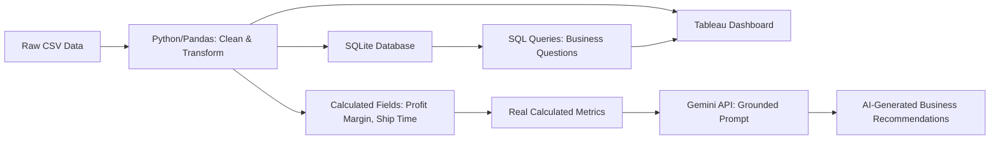

# AI Business Intelligence Dashboard

An end-to-end business intelligence pipeline that cleans raw retail sales data, analyzes it in Python and SQL, visualizes it in an interactive dashboard, and generates AI-powered business recommendations grounded strictly in the underlying data.

## Overview

This project simulates the full workflow of a data analyst at a retail company: taking a messy raw dataset all the way through to boardroom-ready insights. It answers concrete business questions — which products are losing money, which regions to invest in, who the highest-value customers are — using a real ~10,000-row retail sales dataset (Superstore).

## Problem Statement

Businesses generate large volumes of transactional data but often lack the tooling to turn it into clear, actionable decisions. This project builds a pipeline that takes raw sales data and automatically surfaces the metrics and recommendations a business would need to make pricing, regional, and customer-retention decisions — combining traditional analytics with an AI layer for automated interpretation.

## Tech Stack

| Layer | Tools |
|---|---|
| Data cleaning & analysis | Python, Pandas, NumPy |
| Querying | SQL (SQLite) |
| Visualization | Tableau Public |
| AI insights | Google Gemini API |
| Version control | Git, GitHub |
| Environment | Google Colab |

## Architecture



## Setup Instructions

1. Clone this repository
2. Open `superstore_analysis.ipynb` in Google Colab or Jupyter
3. Upload the Superstore dataset (`.csv`) to your Colab session
4. Run cells sequentially — the notebook covers data cleaning, SQL analysis, calculated fields, and AI insight generation
5. For AI insights: get a free Gemini API key at [aistudio.google.com](https://aistudio.google.com), add it as a Colab secret named `Gemini_API_Key`
6. View the live interactive dashboard: [Tableau Public Dashboard](https://public.tableau.com/views/SuperstoreBIDashboard/SuperstoreBIDashboard?:language=en-US&:sid=&:redirect=auth&:display_count=n&:origin=viz_share_link)

## Dashboard

*(Screenshot below — see live interactive version linked above)*


## Key Findings

- **Furniture generates nearly as much revenue as Office Supplies** ($755K vs $732K) but only ~3% profit margin compared to Office Supplies' ~17%, driven by an above-average discount rate (17.3%).
- **Tables are the single biggest profit problem**, losing $17,753 overall — over 4x the next-worst sub-category (Bookcases, -$3,632) — caused by a 25.8% average discount rate, far above the dataset average of ~15.5%.
- **Sales show strong, repeating seasonality**: January/February are consistently the weakest months every year, while September, November, and December are consistently the strongest.
- **Tamara Chand is the most valuable customer**, generating $8,981 in profit — 29% more than the next-highest customer.
- **Profit margin analysis reveals hidden risk**: Binders (-19.5% avg margin) and Appliances (-14.9%) only look profitable in raw dollars due to high sales volume masking many individual money-losing orders.
- **West is the top-performing region** ($110,798 profit), while Central lags despite decent revenue, converting to the lowest profit of any region ($39,865).

## AI-Generated Business Analysis

*Generated using Google Gemini API, grounded strictly in the real calculated metrics above — the model is explicitly instructed not to invent any statistics not present in the data (see notebook for full prompt/code).*

```
Based on the data provided, here is the business analysis addressing your four questions:

1. Which products/sub-categories are performing poorly, and by how much?
The three worst-performing sub-categories by profit are operating at a net loss:
- Tables: -$17,753.21 profit (loss of $17,753.2061)
- Bookcases: -$3,632.07 profit (loss of $3,632.0736)
- Supplies: -$1,171.39 profit (loss of $1,171.3945)

2. Which region should the company focus on, and why?
- To maximize proven growth: The company should focus on the West region, as it is the top profit driver generating $110,798.82, followed by the East region at $94,883.26.
- To address underperformance: Management may need to focus on the Central region, which generated the lowest profit at $39,865.31, as well as the South region at $46,749.43.

3. Who are the most valuable customers?
The top 5 most valuable customers by profit generated are:
1. Tamara Chand: $8,981.32
2. Raymond Buch: $6,976.10
3. Sanjit Chand: $5,757.41
4. Hunter Lopez: $5,622.43
5. Adrian Barton: $5,444.81

4. What should management do next? (Recommendations)
1. Address Unprofitable Sub-Categories: Mitigate or eliminate losses occurring in Tables (-$17,753.21), Bookcases (-$3,632.07), and Supplies (-$1,171.39). This will help improve the overall profit margin of the Furniture category, which is currently generating only $19,729.996 in profit compared to Office Supplies ($126,023.443) and Technology ($146,543.376).
2. Protect and Retain High-Value Customers: Focus retention efforts on key profit-generating accounts like Tamara Chand ($8,981.32) and Raymond Buch ($6,976.10), who represent a key portion of total customer profits across the 800 total customers.
3. Reallocate Capital to High-Margin Categories and Regions: Double down on selling Technology products ($146,543.38 profit) and Office Supplies ($126,023.44 profit) in high-performing markets like the West ($110,798.82 profit) and East ($94,883.26 profit) regions.
```

## Future Improvements

- Add a live database connection (e.g., PostgreSQL) instead of an in-memory SQLite table
- Automate the pipeline to refresh insights on a schedule as new data arrives
- Expand AI integration to support natural-language querying of the dashboard
- Add predictive modeling (e.g., forecasting next month's revenue) using scikit-learn
- Deploy the dashboard publicly with authentication for multi-user access

## Tools

Python · Pandas · NumPy · SQL · Tableau Public · Google Gemini API

## Project Status

**Complete** — Phase 1 of an ongoing data analytics and AI portfolio project.
